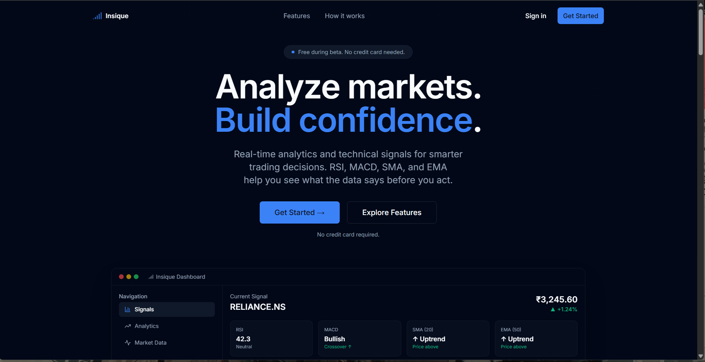
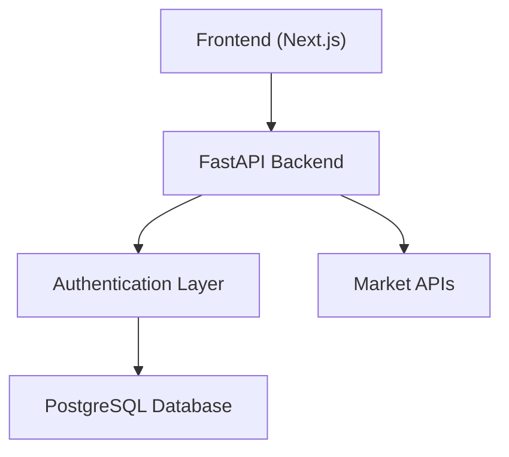
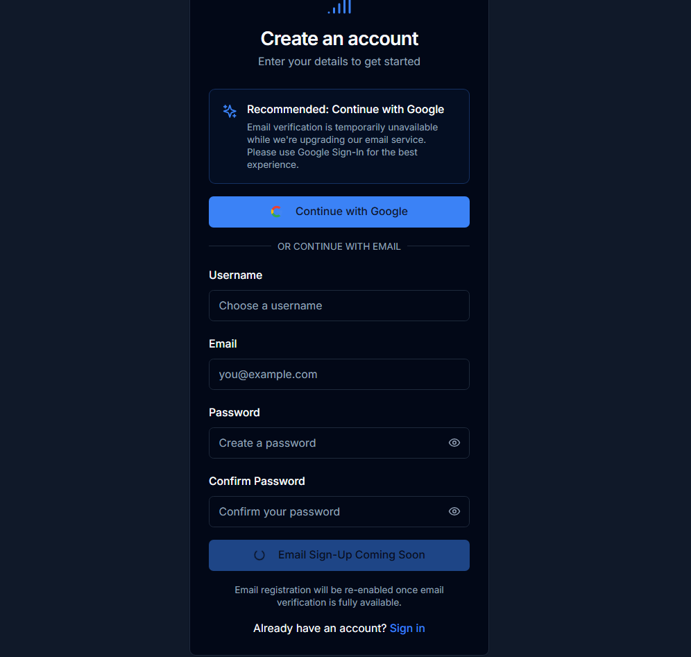
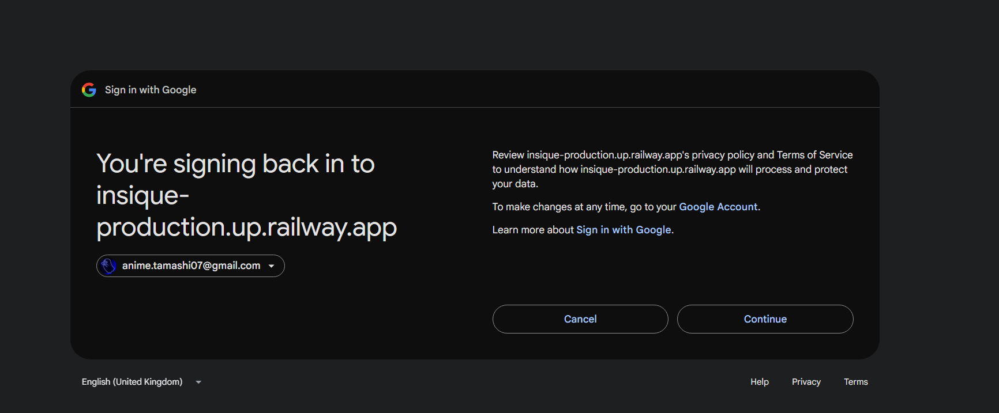
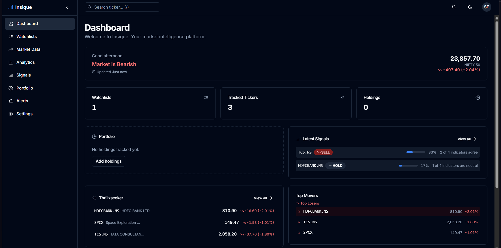
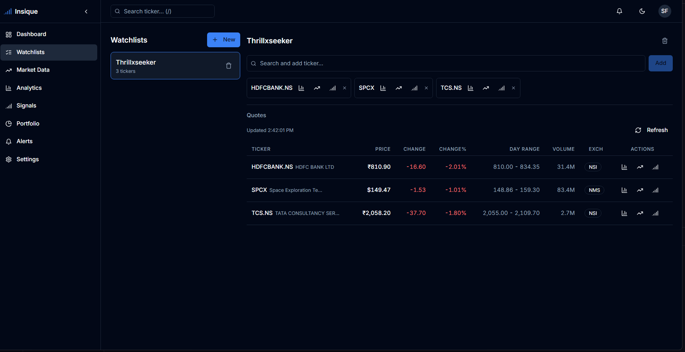
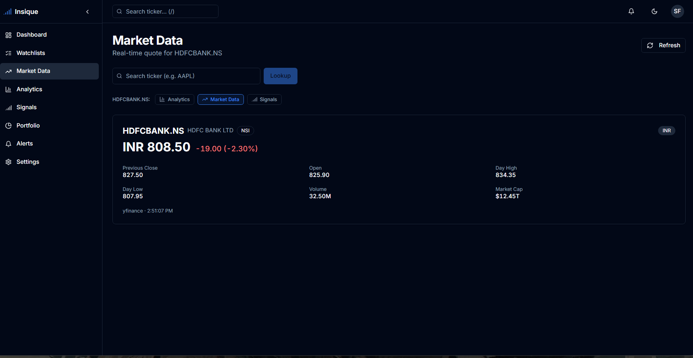
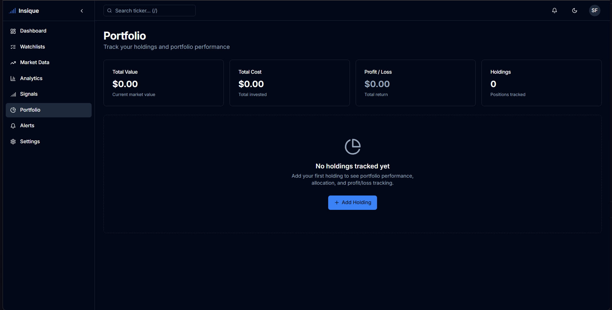
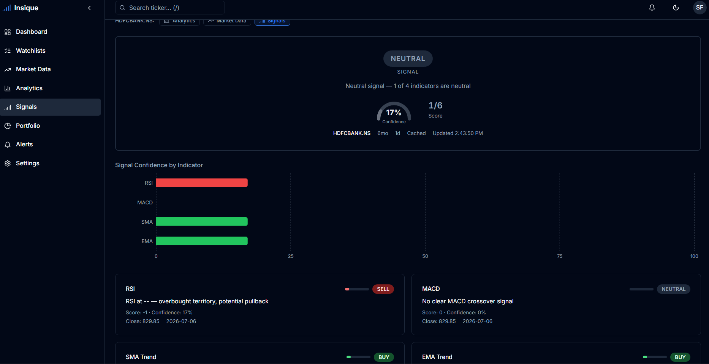

<p align="center">
  
</p>

<h1 align="center">Insique</h1>

<p align="center">
  <strong>Market Intelligence Platform</strong>
</p>

<p align="center">
  <a href="https://insique.vercel.app"> Live Demo</a> •
  <a href="https://github.com/yourusername/insique"> GitHub Repository</a> •
  <a href="#product-demo"> Demo Video</a> •
  <a href="#license"> License</a>
</p>

<p align="center">
  <em>Status: Beta v1.0 - This project is under active development. Feedback and suggestions are welcome.</em>
</p>

<p align="center">

  [](https://python.org)
  [](https://fastapi.tiangolo.com)
  [](https://nextjs.org)
  [](https://typescriptlang.org)
  [](https://postgresql.org)
  [](https://docker.com)
  [](LICENSE)
  [](https://github.com/yourusername/insique)
  [](https://github.com/yourusername/insique)

</p>

> 📹 A complete walkthrough of Insique is available in the demo video.

---

## Product Demo

🎥 Demo Video (Coming Soon)

---

## Description

Insique is a full-stack market intelligence platform that helps users analyze stocks, manage watchlists, monitor portfolios, and generate technical trading signals through a secure and modern web application.

---

## Live Demo

| Platform | URL |
|----------|-----|
| **Live Demo** | [https://insique.vercel.app](https://insique.vercel.app) |


---

## Features

- ✅ Secure JWT Authentication
- ✅ Google OAuth Login
- ✅ Refresh Tokens
- ✅ Email Verification Backend
- ✅ Password Reset
- ✅ Portfolio Management
- ✅ Watchlists
- ✅ Live Market Data
- ✅ Technical Signals
- ✅ Responsive Dashboard
- ✅ PostgreSQL Database
- ✅ Docker Support
- ✅ Railway Deployment
- ✅ Vercel Deployment

---

## Tech Stack

| Layer | Technology |
|-------|-----------|
| **Frontend** | Next.js 15, React, TypeScript, Tailwind CSS |
| **Backend** | FastAPI, SQLAlchemy, PostgreSQL, Alembic, Pydantic |
| **Authentication** | JWT, Google OAuth 2.0 |
| **Email** | Resend |
| **Infrastructure** | Docker, Railway, Vercel, GitHub |

---

## Architecture



---

## Screenshots

### Login



### Google OAuth



### Dashboard



### Watchlists



### Market Data



### Portfolio



### Technical Signals



---

## Running Locally

### Prerequisites

- Python 3.12+
- Node.js 18+
- Docker (optional)

### 1. Clone the repository

```bash
git clone https://github.com/yourusername/insique.git
cd insique
```

### 2. Create environment file

```bash
cp .env.example .env
```

Edit `.env` with your configuration values (database URL, secret key, OAuth credentials, etc.).

### 3. Run with Docker

```bash
docker compose up
```

This starts both the PostgreSQL database and the application.

### 4. Or run manually

**Backend:**

```bash
# Create virtual environment
python -m venv .venv
source .venv/bin/activate  # Windows: .venv\Scripts\Activate.ps1

# Install dependencies
pip install -e .

# Run database migrations
cd backend
alembic upgrade head

# Start the server
cd ..
uvicorn backend.app.main:app --reload
```

The API will be available at `http://localhost:8000`.

**Frontend:**

```bash
cd frontend
cp .env.example .env.local
npm install
npm run dev
```

The app will be available at `http://localhost:3000`.

---

## Environment Variables

### Backend

| Variable | Description | Required |
|----------|-------------|----------|
| `DATABASE_URL` | PostgreSQL connection string | Yes |
| `SECRET_KEY` | JWT signing secret (min 16 chars) | Yes |
| `JWT_ALGORITHM` | JWT signing algorithm (default: HS256) | No |
| `GOOGLE_CLIENT_ID` | Google OAuth client ID | For Google Sign-In |
| `GOOGLE_CLIENT_SECRET` | Google OAuth client secret | For Google Sign-In |
| `GOOGLE_REDIRECT_URI` | Google OAuth callback URL | For Google Sign-In |
| `FRONTEND_URL` | Frontend URL for CORS and redirects | Yes |
| `RESEND_API_KEY` | Resend API key for email delivery | For email features |
| `FROM_EMAIL` | Sender email address | For email features |

### Frontend

| Variable | Description | Required |
|----------|-------------|----------|
| `NEXT_PUBLIC_FASTAPI_BASE_URL` | Backend API base URL | Yes |

---

## Project Structure

```text
insique/
├── backend/
│   ├── app/
│   │   ├── api/          # API routes and dependencies
│   │   ├── core/         # Config, security, database session
│   │   ├── models/       # SQLAlchemy models
│   │   ├── repositories/ # Data access layer
│   │   ├── schemas/      # Pydantic schemas
│   │   └── services/     # Business logic
│   ├── alembic/          # Database migrations
│   └── tests/            # Backend tests
├── frontend/
│   ├── app/              # Next.js pages
│   ├── components/       # UI components
│   ├── features/         # Feature modules
│   └── lib/              # Utilities and API client
├── docs/                 # Documentation assets
├── docker-compose.yml    # Docker Compose configuration
├── Dockerfile            # Backend Dockerfile
├── pyproject.toml        # Python project configuration
└── README.md
```

---

## Testing

### Backend

```bash
cd backend
pip install -e ".[dev]"
pytest -v
```

### Frontend

```bash
cd frontend
npm run lint
npm run build
```

---

## Current Status

- **Google Sign-In** is fully functional.
- **Email verification** backend is complete.
- **Email registration** is temporarily disabled in production because a custom sending domain has not yet been configured with Resend.
- The functionality will be enabled once the production email domain is verified.

---

## Future Roadmap

- AI-powered stock insights
- Portfolio analytics and performance tracking
- Price alerts with push notifications
- Advanced charting with interactive indicators
- Dark/Light themes
- Mobile optimization
- Performance improvements and caching

---

## Learning Outcomes

This project involved learning and applying:

- Production authentication flows (JWT, OAuth 2.0)
- Google OAuth integration and ID token verification
- Database migrations with Alembic
- Docker containerization and deployment
- RESTful API design with FastAPI
- Full-stack deployment (Vercel, Railway)
- Secure backend development practices
- Email service integration with Resend
- Frontend state management with TanStack Query

---

## License

MIT

---

## Disclaimer

Insique is an educational and analytical platform. It does not provide financial advice, investment recommendations, or guarantees of future performance. Users should conduct independent research and evaluate risk before making investment decisions.
